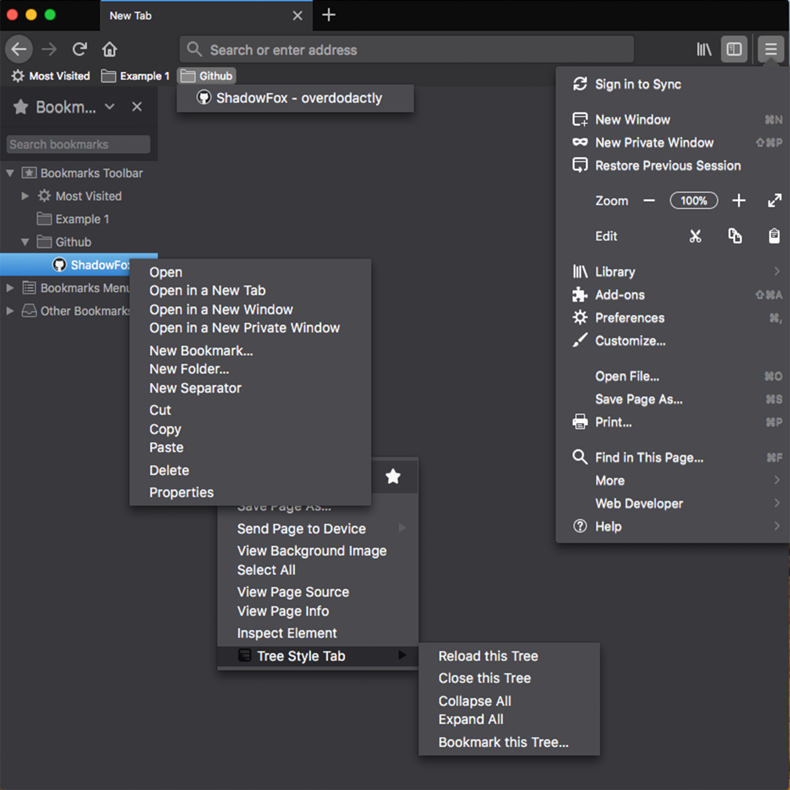
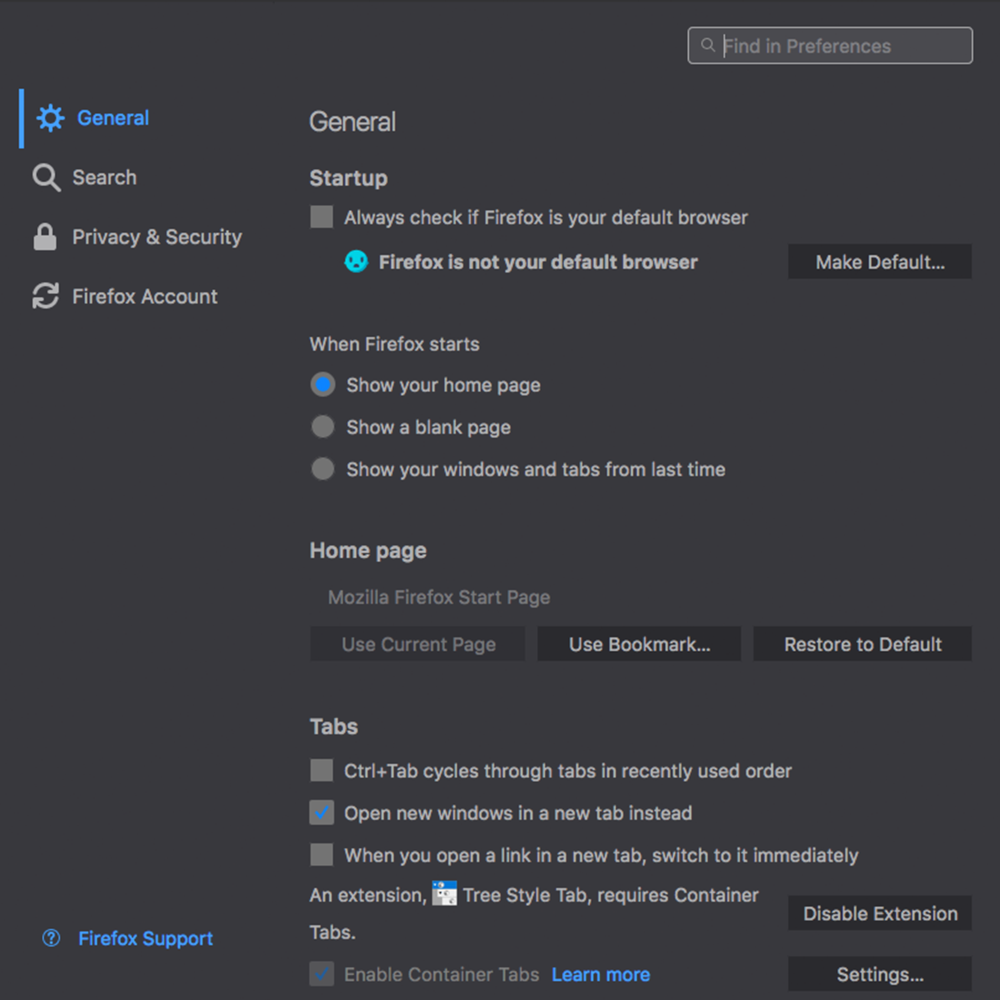
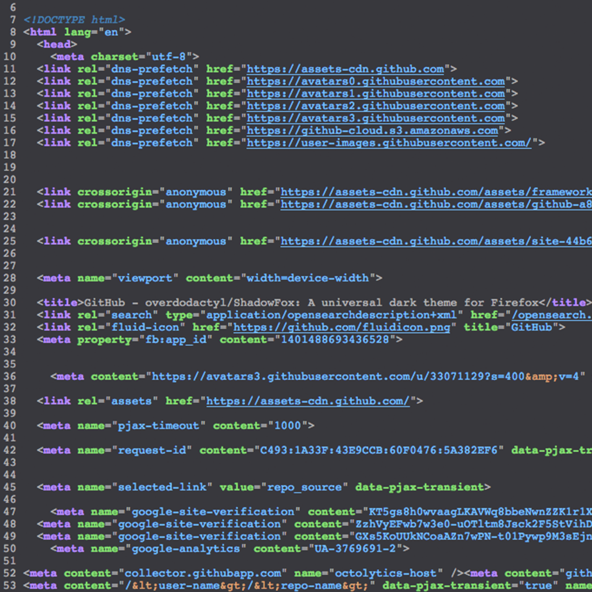

# What is ShadowFox?

ShadowFox is a collection of `userChrome.css` and `userContent.css` tweaks to supplement and expand the dark theme provided by Mozilla.

# What modifications does ShadowFox make?

All modifications can be split into two categories: (1) Changes to the user interface (`userChrome.css`) and (2) Changes to webpages (`userContent.css`).

## userChrome tweaks

Modification to the following items have been made to match the Firefox dark theme:

* Sidebar
* Library
* Smart bar and search bar drop downs
* Context menus
* Menus accesssed from the nav bar
* Customization page
* Tab line and secure connection icon
* About Firefox dialog box
* Status panels
* Remove white flash on page load
* Findbar

## userContent tweaks

#### about: pages

All `about:` pages have been styled (e.g. `about:addons`, `about:preferences`, `about:config`, `about:profiles` etc.)

#### Webpages

The following webpages have been styled to match the dark theme:

* addons.mozilla.org
* `view-source` pages
* manifest.json pages
* Dierectory listing pages (`file:///`)
* `https://raw.githubusercontent.com/...`
* pdfs

#### Webextension Tweaks

Themes for 20+ popular webextensions have been made.  By nature, these changes can not go into effect without user action.  To see what extensions have been styled, as well as how to make the changes go into effect, see [here](https://www.reddit.com/r/ShadowFoxCSS/comments/7yt5c0/test_post/).

# What do the changes look like?

Here are just a few examples:

Context Menus and Sidebar                   | `about:` pages
:------------------------------------------:| :------------------------------------------:                                         
 | 

`view-source:` pages                        | Mozilla Addon Store
:------------------------------------------:| :------------------------------------------:                                         
   | 

# How do I install/modify ShadowFox

Please see [here](https://github.com/overdodactyl/ShadowFox/wiki).

# Looking for more information or experiencing problems?

Please take a look through the [wiki](https://github.com/overdodactyl/ShadowFox/wiki) and [Issues](https://github.com/overdodactyl/ShadowFox/issues?q=is%3Aopen) (both open and closed).  If you can't find what you need, don't hesitate to open up a new issue.  

# Run into a bug?

If you'v

# Have a feature request?

Please read through the current issues and search old ones.  If it doesn't already exist, feel free to ask!

# Have a question or need help?

Please be sure to read through the [wiki](https://github.com/overdodactyl/ShadowFox/wiki/), and any

If your question is not addressed, please feel free to either:

* Open a new

# Contributing

I welcome any contributions and would be excited to have a team of people helping with this project.  If you are uncomfortable making pull requests, you can simply open up an issue and attach any code you would like included.
