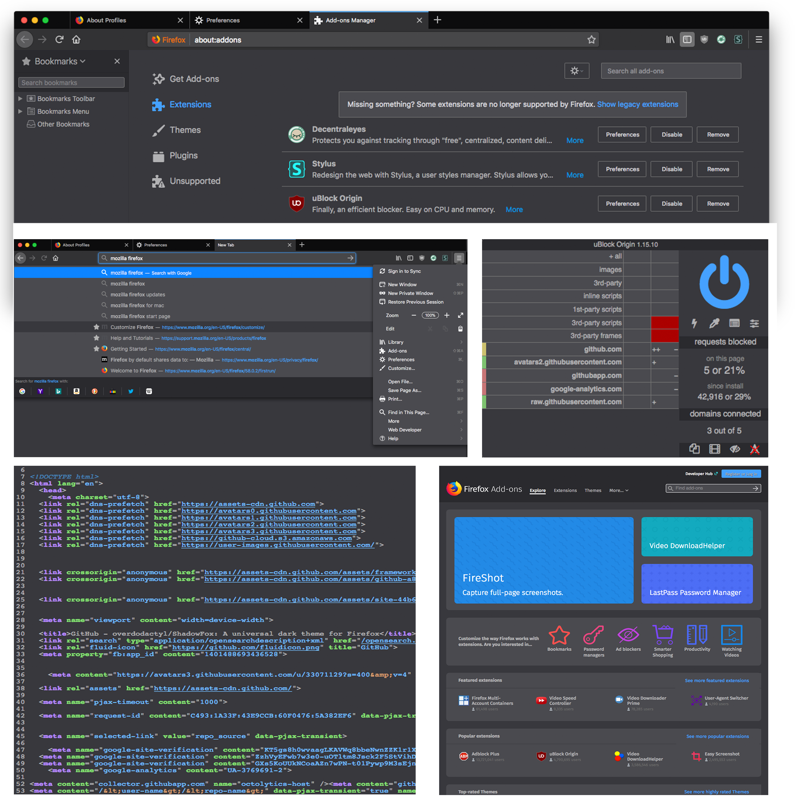

ShadowFox was inspired by changes made in Firefox 57, which limited the amount addons could customize both the user interface and "protected" web pages.

This project aims at creating a universal dark theme for Firefox while adhering to the modern design principles set by Mozilla.

## Preview

ShadowFox styles the entire user interface, protected webpages (such as `about:` pages and addons.mozilla.org), and over 20 popular addons.

## Installation

* Download the updater script from the [releases](https://github.com/overdodactyl/ShadowFox/releases) page for your operating system.

* Place this script in your Firefox profile directory.

  * Visit `about:support` by entering this address in the url bar.

  * Scroll down to `Application Basics`.

  * In the `Profile Folder` section, click the button that says "Open Folder", "Show in Finder" or "Open Directory" (OS dependent).

    * On Windows and Linux, this should take you directly to your profile directory. On a Mac, this will take you to a list of Firefox profiles, with the one you want highlighted. In this case, double click that folder to open it.

* Run the script.

* Restart Firefox.

***IMPORTANT***: Changes to webextensions do not go into effect by default. For more information, see [here](https://github.com/overdodactyl/ShadowFox/wiki/Altering-webextensions).

## Updating

* Run the updater script.

## Customization

It's easy to customize ShadowFox, everything from the colors used to what elements and webpages are styled.  Depending on how much you want to customize ShadowFox, you may be better suited using a different installation process.  To learn more, see [here](https://github.com/overdodactyl/ShadowFox/wiki/Getting-Started).

## Discussion

* Chat about ShadowFox Slack - [invitation link](https://join.slack.com/t/shadowfox-workspace/shared_invite/enQtMzI5Nzk5OTk1MjcxLThkMDgwOGE5ZDY1MDUyNjIwNWQ2MTlmMjEwZTJiZmZjYTUxODM4ZTRkNzhiNGRhZTFhMjdjMTFjMTQ3YjZjYzU)

## Find a bug? Have a feature request? Have any questions?

Please first read through the [wiki](https://github.com/overdodactyl/ShadowFox/wiki/) (including the getting started information, troubleshooting, and known problems) and take a look at any open [issues](https://github.com/overdodactyl/ShadowFox/issues).  If you can't find a duplicate request, bug, or an answer to your question, please feel free to either:

* Open a [new issue](https://github.com/overdodactyl/ShadowFox/issues/new)

* Make a post on the ShadowFox [Reddit page](https://www.reddit.com/r/ShadowFoxCSS/).

## Contributing

I welcome any contributions and would be excited to have a team of people helping with this project.  If you are uncomfortable making pull requests, you can simply open up an issue and attach any code you would like included.
