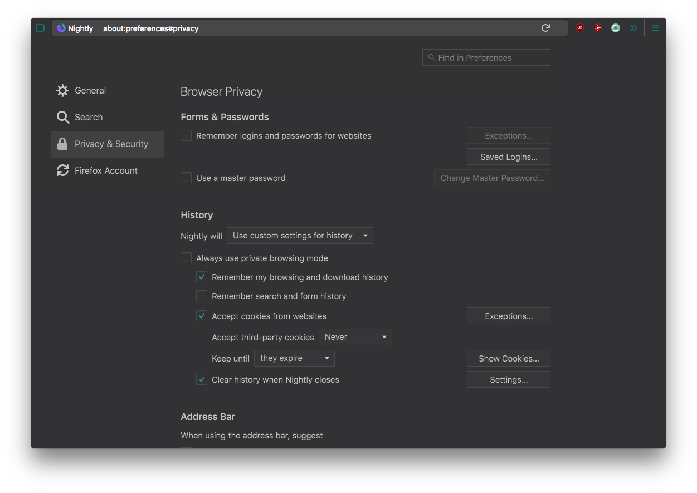
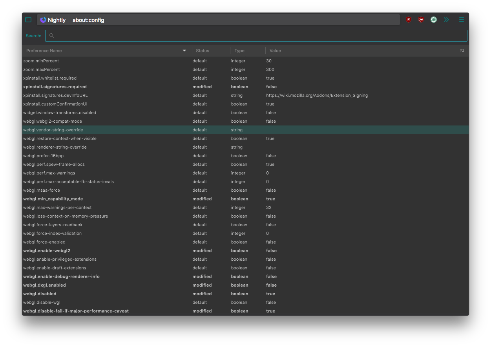
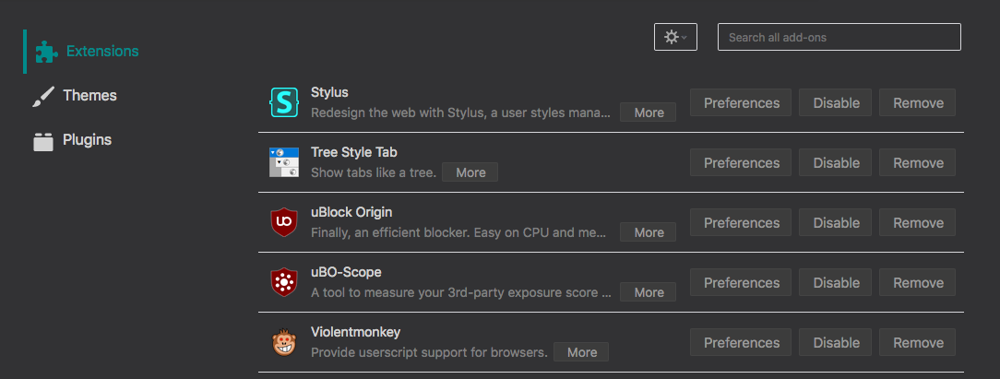
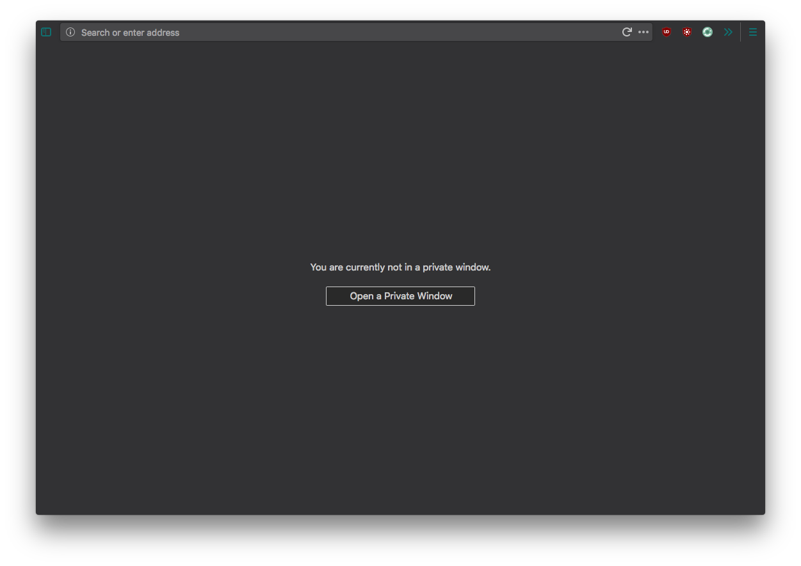
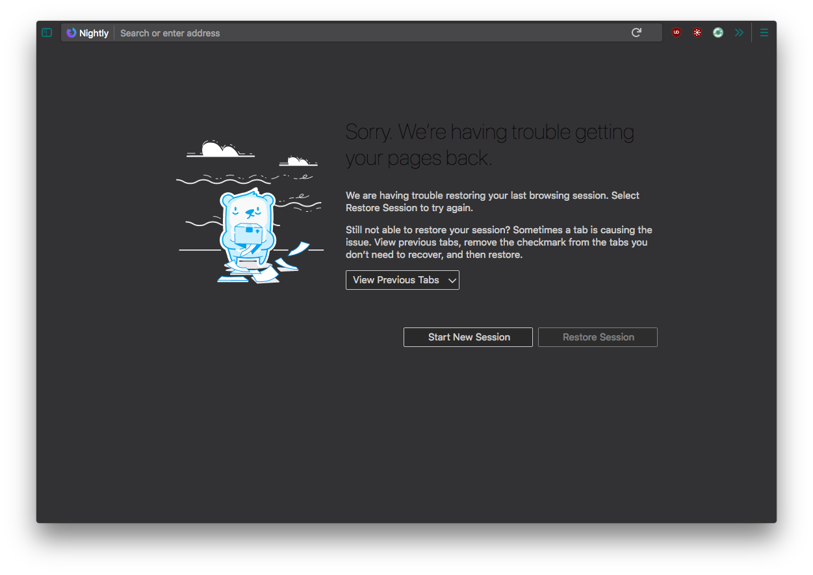

# userContent-tweaks

Currently, the scope of this project involves improving `about` pages for Firefox 57+ users who prefer a dark theme.  Depending on available time and user contributions, this repository could evolve into a centralized location for all userContent.css tweaks.  

## What is userContent.css?

In short, userContent.css is a file used to define and customize web page content.  This file does not exist in a Firefox profile by default, and must be created by the user.

#### Where does the userContent.css file go?

Like userChrome.css, userContent.css resides in a subdirectoy titled `chrome` within your Firefox profile.  

#### How do I get to my profile directory?

The location of your profile depends on your operating system.  Nevertheless, the following steps should always work:

* Use the address bar to visit `about:support`

* Click on the Show in Finder/Show Folder button available next to the label `Profile Finder`.

##### I'm in my profile directory, what now?

Look for a folder titled `chrome`.  This folder does not exist by default, so if you don't see it, create it yourself.  

You can now dowload the zip file of this repository, and put it's contents within your `chrome` folder.  

*_IMPORTANT_: if you already have a userContent.css file, copy the contents of `userContent-about_pages.css` to your existing file.  If you do not, change the name of `userContent-about_pages.css` to `userContent.css`.   

## What do the changes look like?

Here are just a few examples:

# Can I contribute?

Of course! Ideally, I would like this repository to be driven by user contributions.  There are a large number of `about` pages, and I have just scratched the surface (to see them all, visit `about:about`).  I would love to have your help completeing the rest. This project is truly in it's infancy, so please feel free to make suggestions, tell me where I've made mistakes, and make suggestions.

I'm open to anything, so if you would like to contribute in any way, please let me know. I don't want to limit this repository to only changes in `about` pages...that's just what I began working on.  You can submit pull requests, or message me on Reddit if you have something you want to discuss/share :)

### [ToDo]

Code standardization

Site sources

